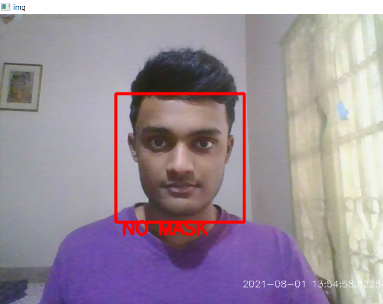
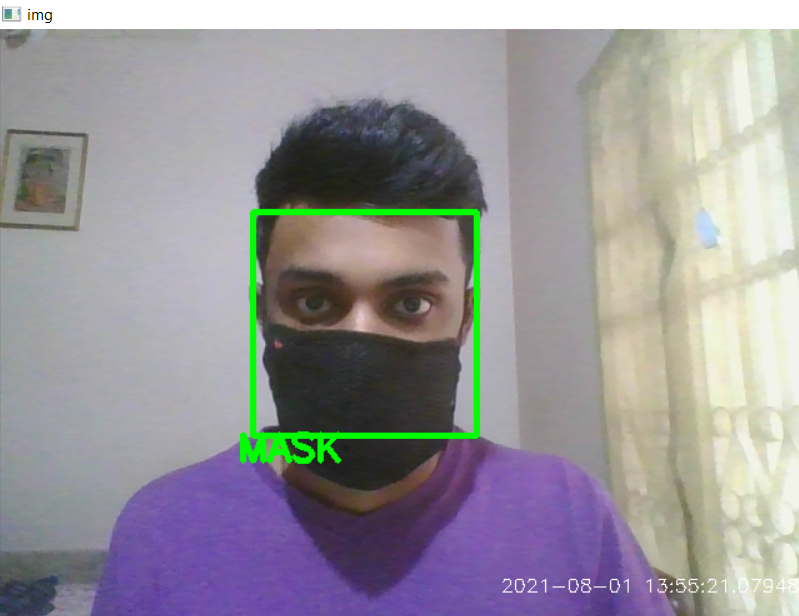
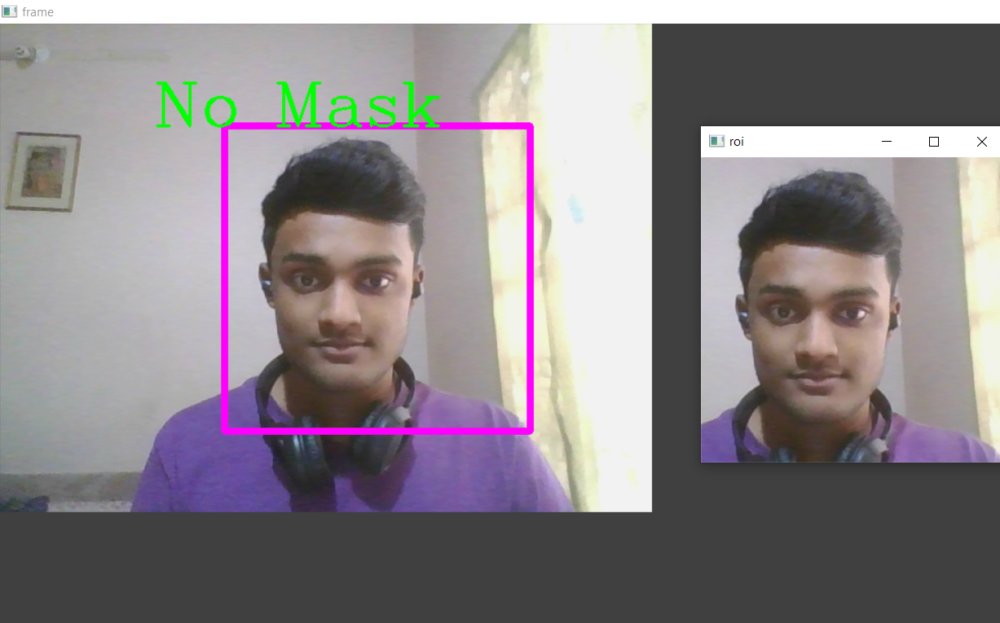
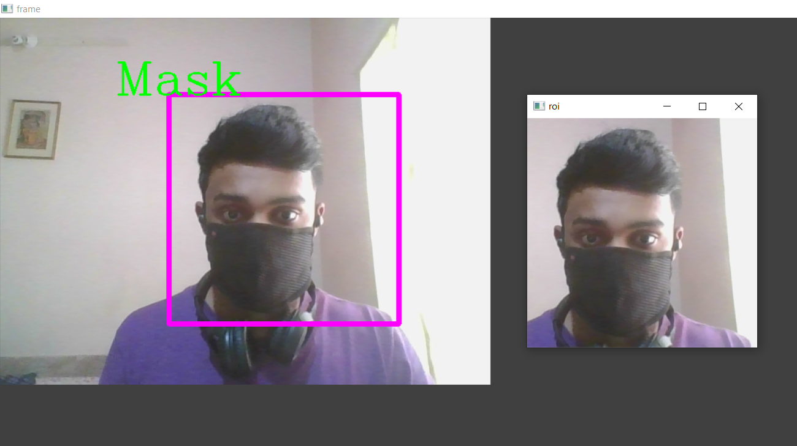

# COVID-19 Face-Mask Detector
Real time face-mask detection using Deep Learning and OpenCV

## About Project
* This project uses a Deep Neural Network, more specifically a Convolutional Neural Network, to differentiate between images of people with and without masks. The CNN manages to get an accuracy of **98.72 % on the test set**. Then the stored weights of this CNN are used to classify as mask or no mask, in real time, using OpenCV.
With the webcam capturing the video, the frames are preprocessed and and fed to the model to accomplish this task. The model works efficiently with no apparent lag time between
wearing/removing mask and display of prediction.

* I have used 2 methods to detect mask in live video stream.
   * 1. In the first method I have used just OpenCV to define a Region Of Interest (ROI) and the model detects the presence or absence of mask on aperson's face if the person's face is in the ROI.
   * 2. In the second method I have used HaarCascades to detect the face/faces and then predict if a person is wearing a mask or not.

## Working using method 'a' :

### No Mask

### With Mask

## Working using method 'b' :

### No Mask

### With Mask

## Dataset

* I have used OpenCV to capture my own images to create a dataset of train and test images

**COVID-19 face mask detector:::::**

* In order to train a custom face mask detector, we need to break our project into two distinct phases, each with its own respective sub-steps (as shown by Figure 1 above):::::

* **Training**: Here we’ll focus on loading our face mask detection dataset from disk, training a model (using Keras/TensorFlow) on this dataset, and then serializing the face mask detector to disk.
* **Deployment**: Once the face mask detector is trained, we can then move on to loading the mask detector, performing face detection, and then classifying each face as with_mask or without_mask.

PROCESS REQUIRED:
-----------------------
* Data extraction
* Building the Dataset class
* Building our face mask detector model
* Training our model
* Testing our model on real data -> IMAGE/VIDEO
* Results

STEPS USED:
-----------------------------------------------------------
1 - Implementing our COVID-19 face mask detector training script with Keras and TensorFlow::::::::

2- Training the COVID-19 face mask detector with Keras/TensorFlow

3 - Implementing our COVID-19 face mask detector for images

4 - COVID-19 face mask detection in images with OpenCV

5 - Implementing our COVID-19 face mask detector in real-time video streams with OpenCV

6 - Detecting COVID-19 face masks with OpenCV in real-time Video Streams 

SUMMARY/RESULT
---------------
* Developed detection Model with 98.72% accuracy, automatically detects if a person is wearing mask or not.

* Define a ROI .

* Determined the class label encoding based on probabilities associated with color annotation

Future Scope
------------
Can be used in CCTV cameras for a group of people.

Can be improved for further as per requirements.

